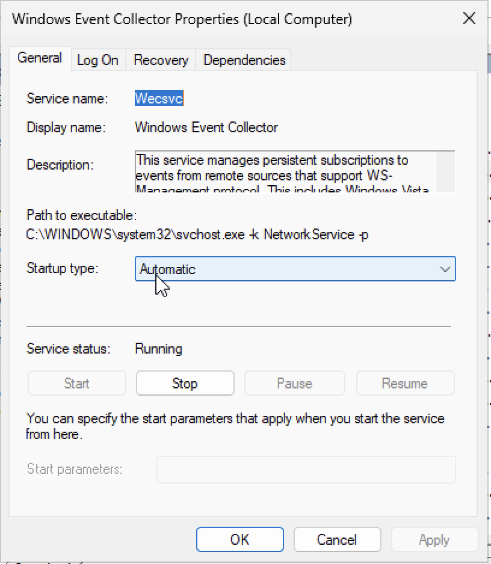
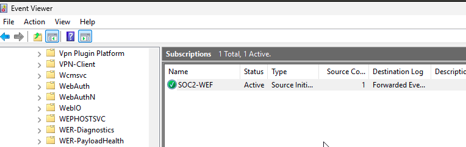
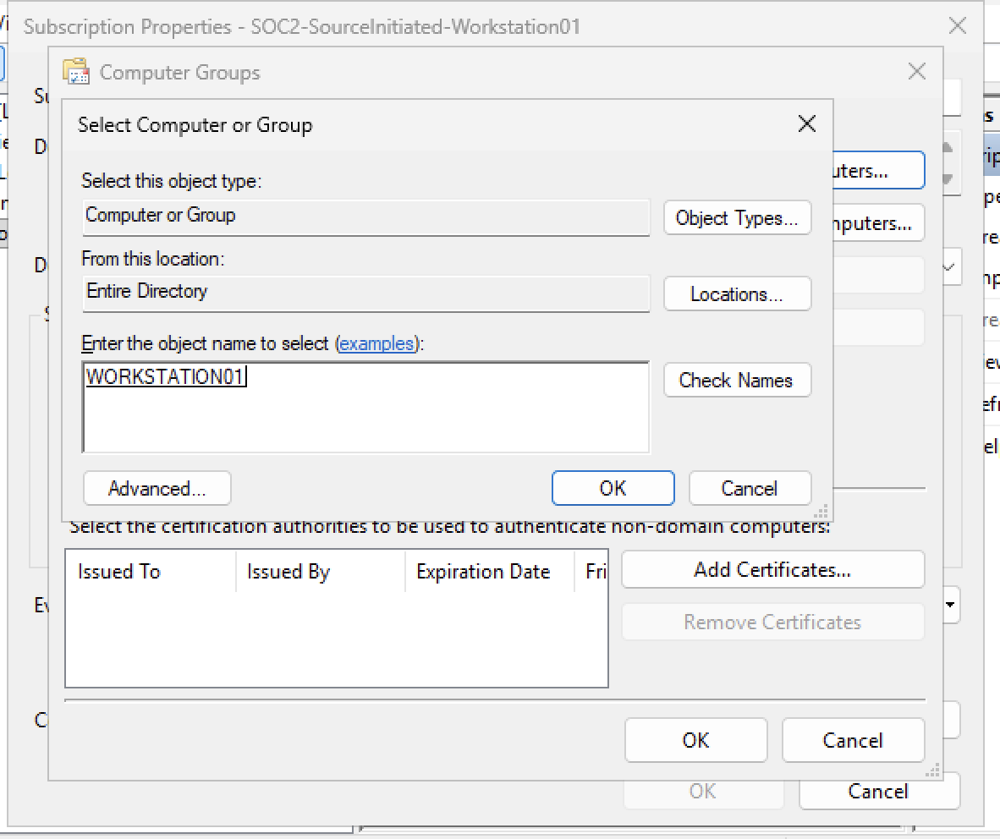
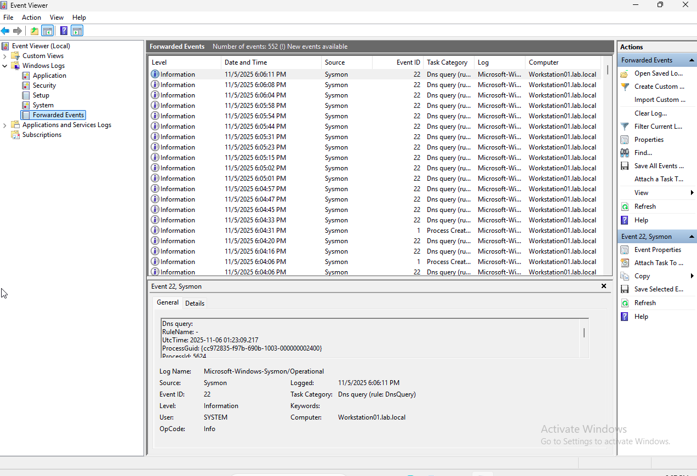
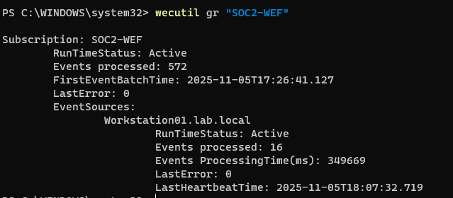
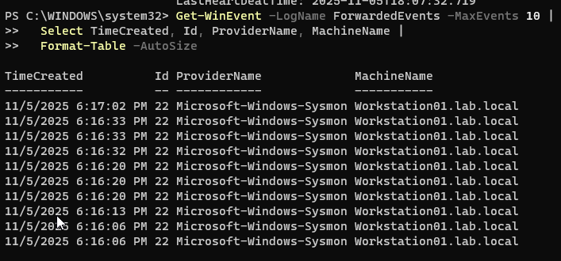
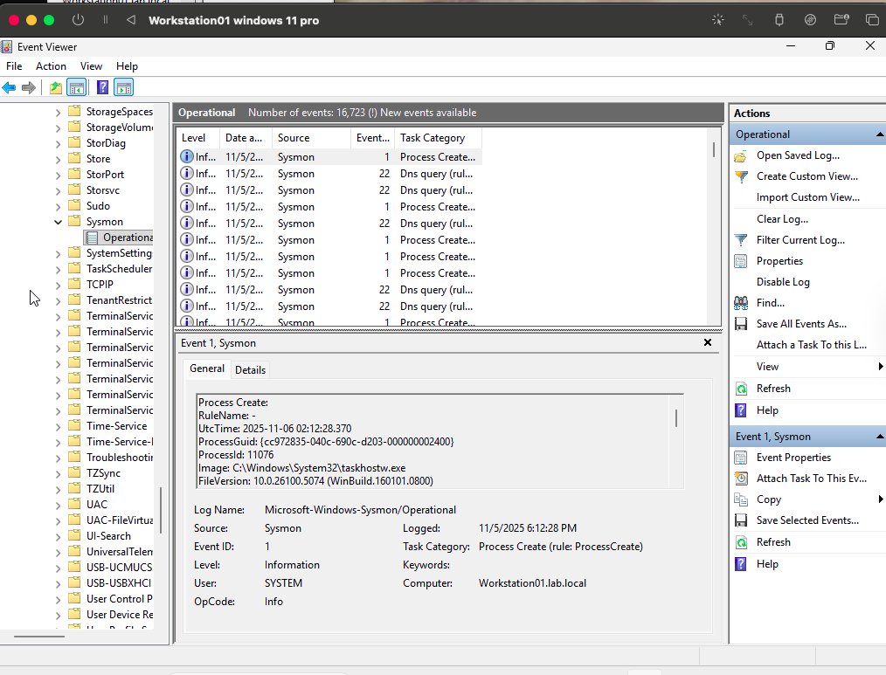
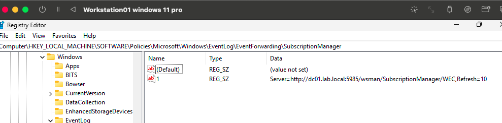

# SOC Lab 2 - Windows Event Forwarding (WEF) + Sysmon

## 🎯 Objective
Configure Windows Event Forwarding (WEF) to collect Sysmon logs from a workstation (Workstation01) and forward them to the Domain Controller (DC01).  
This lab proves:
- Sysmon is running locally on the endpoint
- WEF subscription is active and forwarding events
- Forwarded Sysmon logs are visible on the collector (DC01)

---

## 🖥️ Lab Environment

| System | Hostname | Role | Notes |
|--------|----------|------|-------|
| Windows Server 2025 | `DC01.lab.local` | Event Collector + Domain Controller | Receives logs |
| Windows 11 Pro | `Workstation01.lab.local` | Event Forwarding Client | Sends Sysmon logs |
| Sysmon Config | `SwiftOnSecurity.xml` | Installed on Workstation01 | Event ID coverage |

---

## ✅ Steps Completed
1. Enabled Windows Event Collector service on DC01  
2. Created a **Source-Initiated** subscription named `SOC2-WEF`  
3. Applied subscription via Group Policy  
4. Verified registry config on Workstation01  
5. Confirmed forwarded Sysmon events arriving on DC01  
6. Validated via PowerShell + Event Viewer

---

## 📸 Evidence Screenshots

### 🏢 DC01 (Collector)

| # | Screenshot | Description |
|---|------------|-------------|
| 1 |  | WEC service enabled and running |
| 2 |  | `SOC2-WEF` subscription shows **Active** |
| 3 |  | New subscription created in Event Viewer |
| 4 |  | Sysmon logs visible in `ForwardedEvents` |
| 5 |  | `wecutil gr "SOC2-WEF"` shows **RunTimeStatus: Active** |
| 6 |  | PowerShell confirms logs from `Workstation01.lab.local` |

---

### 🖥️ Workstation01 (Forwarder)

| # | Screenshot | Description |
|---|------------|-------------|
| 7 |  | Local Sysmon logs prove Sysmon is installed & running |
| 8 |  | Registry confirms WEF subscription assigned via GPO |

---

## 🔍 Validation

| Test | Result |
|------|--------|
| `wecutil gr "SOC2-WEF"` | ✅ Active |
| Heartbeat received | ✅ Yes |
| Sysmon events forwarded | ✅ Yes |
| PowerShell event query | ✅ Shows MachineName `Workstation01.lab.local` |
| Group Policy applied | ✅ Confirmed via registry |

---

## 📚 What I Learned
- How **source-initiated** WEF subscriptions work  
- How Sysmon logs can be centralized for SOC visibility  
- How to verify WEF with both GUI and PowerShell  
- Importance of registry + event log validation  
- How `ForwardedEvents` acts as a staging log for SIEM ingestion

---
