# SOC Lab 4 – Network Traffic Analysis with Wireshark + Nmap

## 📌 Overview

In this lab, I used **Nmap** to scan an Active Directory Domain Controller (`DC01`) from a Windows workstation (`WORKSTATION01`) and captured the traffic using **Wireshark**. Both **SYN scan (`-sS`)** and **service detection scan (`-sV`)** were used while analyzing the resulting traffic to determine open/closed ports and fingerprint services.

This lab demonstrates **packet-level validation of port scans**, cross-platform network traffic analysis (Windows to macOS), and foundational SOC skills including **OSINT on services, understanding remote attack surfaces (e.g., WinRM), and using packet inspection to validate discovery activity**.

---

## 🏗️ Architecture Diagram

┌───────────────────────────┐
│ WORKSTATION01 │
│ • Nmap Scanner │
│ • Wireshark Capture │
└─────────────┬─────────────┘
│ (Local subnet 192.168.64.0/24)
▼
┌───────────────────────────┐
│ DC01 (Domain Controller) │
│ • Open ports: 5985, 445, 389, etc. |
│ • Services: WinRM, LDAP, SMB, Kerberos |
└───────────────────────────┘

markdown
Copy code

---

## 🛠️ Tools & Technologies

| Tool/Service         | Purpose |
|----------------------|---------|
| **Nmap**             | Host discovery, SYN scan, service version scan |
| **Wireshark**        | Real-time packet capture and analysis |
| **PowerShell**       | Running Nmap and exporting scan results |
| **UTM (macOS)**      | Virtualized Windows environment for lab |
| **macOS (Host)**     | Analyzed saved `.pcapng` trace using Wireshark |

---

## 🎯 Objectives

- ✅ Perform ARP/ICMP host discovery using `nmap -sn`
- ✅ Execute SYN port scan (`nmap -sS`)
- ✅ Use Wireshark to confirm SYN/ACK (open ports) and RST (closed ports)
- ✅ Fingerprint running services using `nmap -sV`
- ✅ Save packet capture file (`.pcapng`) and review it cross-platform
- ✅ Validate open port **5985 (WinRM)** using both Nmap and packet details

---

## 🔄 Process Summary

1. Installed Wireshark and Nmap on `WORKSTATION01`
2. Verified network connectivity via `ping` and `ipconfig`
3. Started Wireshark capture and ran `nmap -sn` (host discovery)
4. Observed **ARP** packets confirming `DC01` is active
5. Performed SYN scan and confirmed open ports via SYN/ACKs
6. Used `nmap -sV` to gather service fingerprints (e.g., `Microsoft HTTPAPI`)
7. Saved `.pcapng` and opened it on macOS Wireshark for validation

---

## 🖼️ Screenshots

All screenshots are stored under `./screenshots/`:

## 🖼️ Screenshots

### 01 — Wireshark installed on macOS  
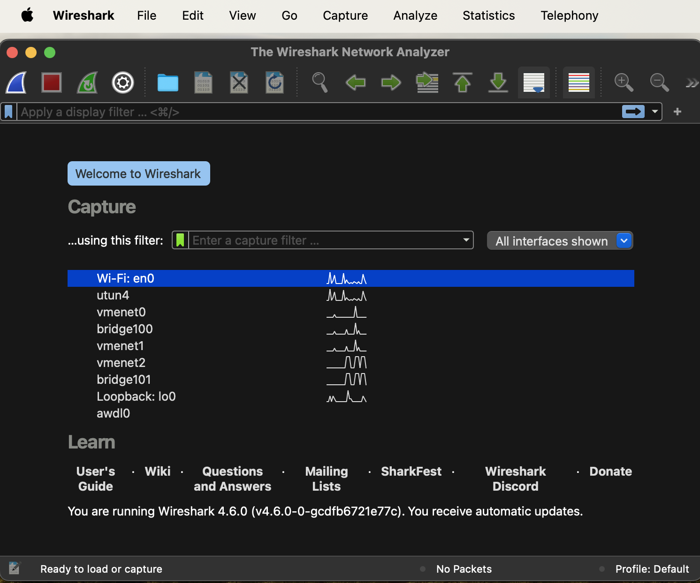

### 02 — Wireshark on Workstation01 (Windows VM)  
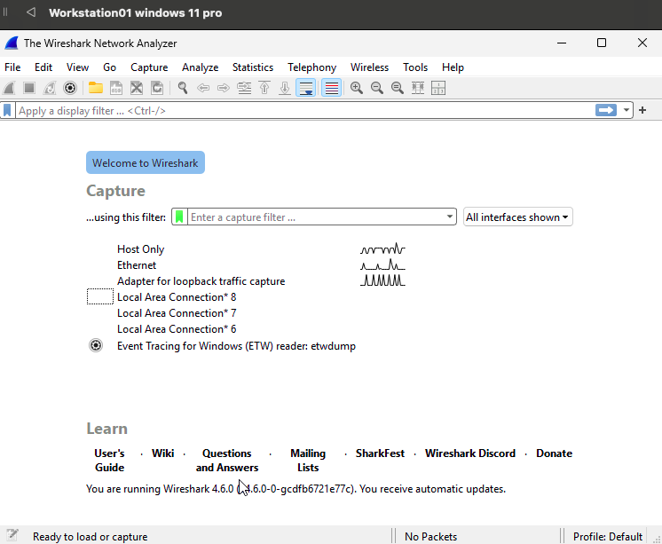

### 03 — Nmap version output  
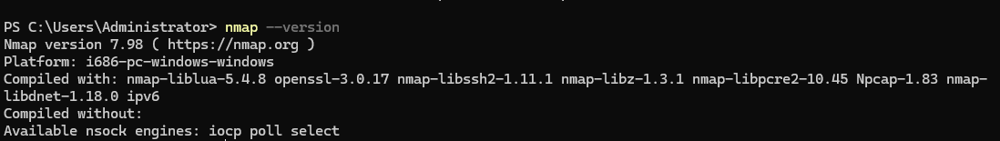

### 04 — Workstation01 IP information  
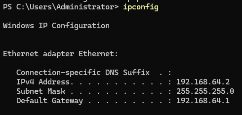

### 05 — Ping successful to DC01  
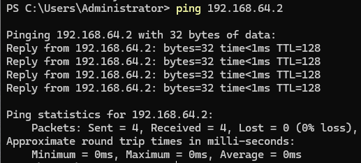

### 06 — Live capture started in Wireshark  
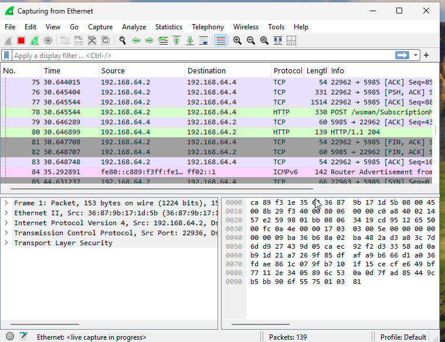

### 07 — Host discovery (`nmap -sn`)  
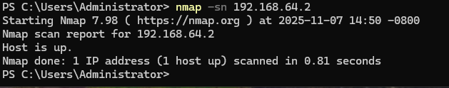

### 08 — ARP response detected for DC01  
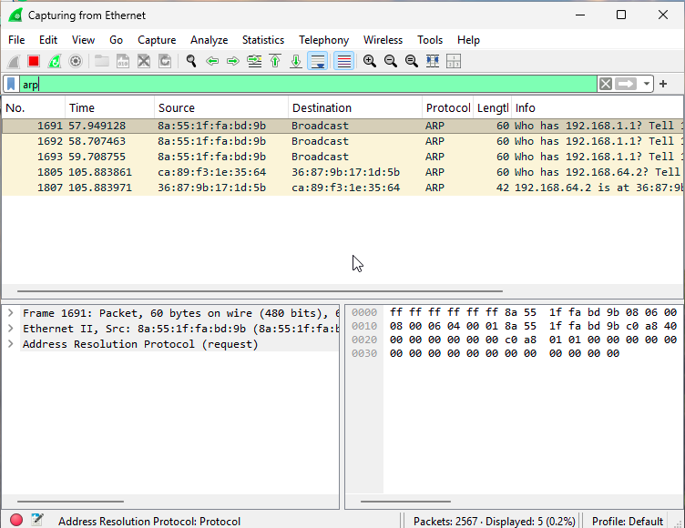

### 09 — SYN scan (`nmap -sS`)  
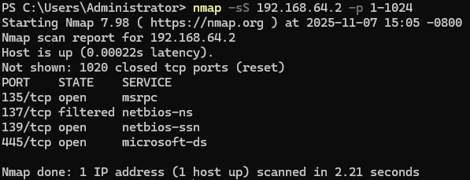

### 10 — Saved `.pcapng` evidence  
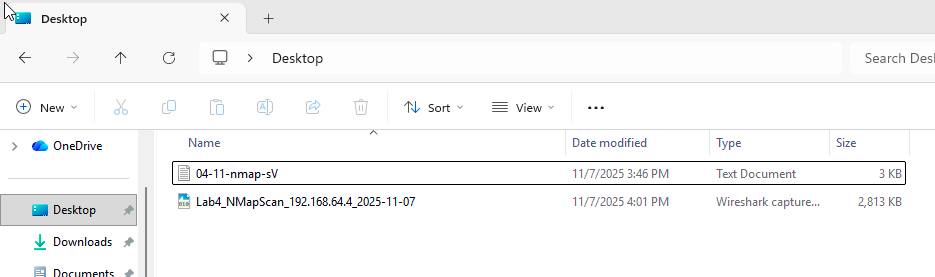

### 11 — SYN packets sent to DC01  
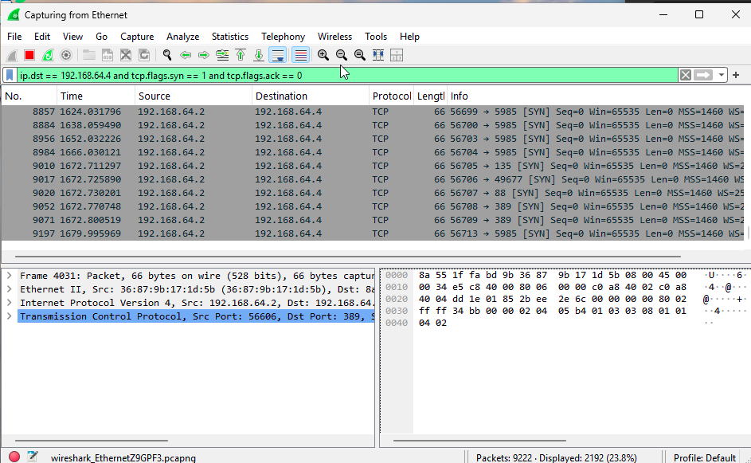

### 12 — RST packets from closed ports  
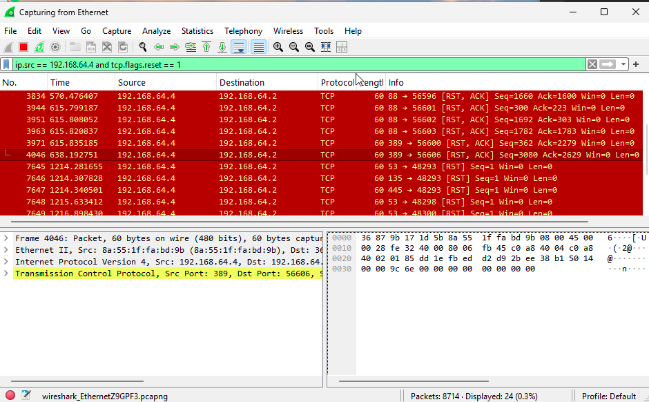

### 13 — SYN/ACK confirming open port (WinRM 5985)  
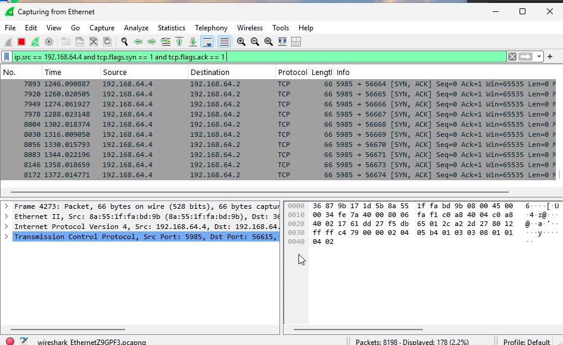

### 14 — Nmap service/version detection  
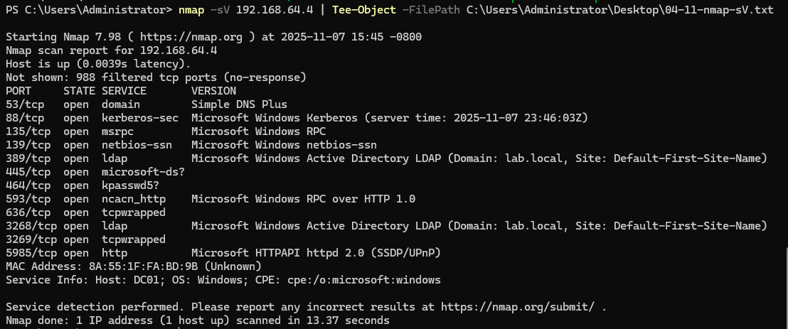

### 15 — Filtered traffic showing DC01 packets  
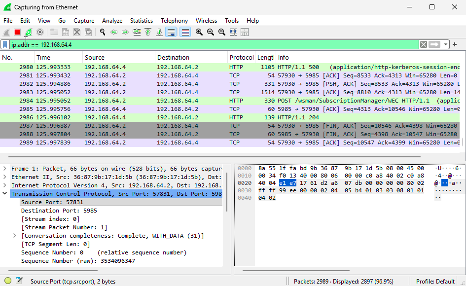

### 16 — Service fingerprint showing `HTTPAPI` header  
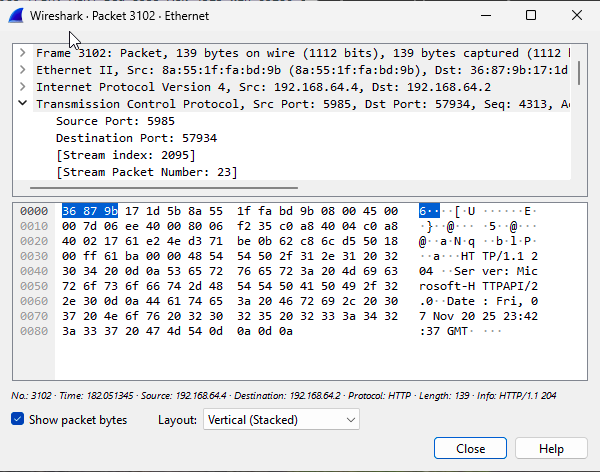

### 17 — `.pcapng` file opened in Wireshark on macOS  
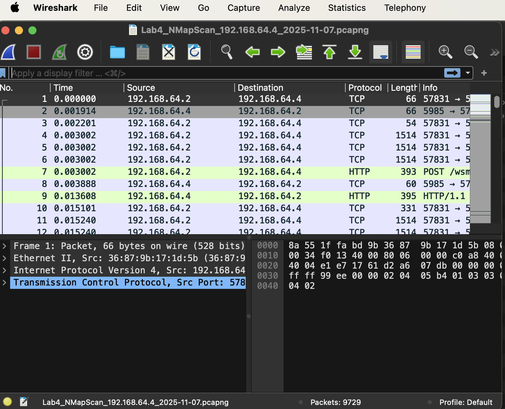

---

## 🔧 Commands Used

### ✅ Workstation network info & ping
```powershell
# Show IP configuration
ipconfig

# Test connectivity to DC01
ping 192.168.64.4
✅ Host discovery
powershell
Copy code
# Host discovery (ARP/ICMP)
nmap -sn 192.168.64.4
✅ SYN port scan
powershell
Copy code
# SYN scan (privileged) for ports 1-1024
nmap -sS 192.168.64.4 -p 1-1024
✅ Service / version detection
powershell
Copy code
# Probe services and save output to Desktop
nmap -sV 192.168.64.4 | Tee-Object -FilePath C:\Users\Administrator\Desktop\04-11-nmap-sV.txt
✅ Result Verification
Host reachability

ARP and ICMP traffic show DC01 (192.168.64.4) is up and reachable.

Open port confirmation

SYN → SYN/ACK observed for port 5985 (WinRM) — confirms the port is open.

Packet header contained Microsoft-HTTPAPI/2.0, matching WinRM fingerprint.

Closed ports

Multiple scanned ports returned RST from the target — confirms those ports are closed.

Service fingerprinting

nmap -sV results match packet-level evidence (HTTP responses on 5985 and other AD-related services).

Cross-platform validation

.pcapng captured on Windows was moved and opened in macOS Wireshark for offline analysis and verification.

🧠 What I Learned
Difference between SYN scans and full TCP connections (how SYN, SYN/ACK, ACK, RST indicate port state).

How to confirm open vs closed ports using packet evidence (SYN/ACK = open; RST = closed).

How to capture and interpret ARP, SYN, SYN/ACK, and RST packets in Wireshark.

How Nmap -sV service detection correlates with packet-level banner information (Microsoft-HTTPAPI/2.0 for WinRM).

The security implications of exposed services (example: WinRM) and basic mitigation ideas (restrict access, use HTTPS, monitor auth events).