# 🧩 SOC Lab 5 – Endpoint Incident Response (Native Windows Tools)

## 🎯 Objective
Simulate and investigate a Windows endpoint compromise **without Sysmon, WEF, or Splunk**.  
Use **native PowerShell and built-in Windows tools** to detect persistence, gather evidence, and document findings as a SOC analyst.

---

## 🧠 Scenario
A suspicious PowerShell script (`setup_persistence.ps1`) was executed on **WORKSTATION01**, creating a scheduled task that maintains persistence and drops a possible malicious binary under `C:\Temp\evil`.  
Your role as the analyst is to:
1. Identify the persistence mechanism.  
2. Inspect active processes, services, and network connections.  
3. Verify startup registry keys.  
4. Compute a file hash for the suspected payload.  
5. Collect artifacts and create an investigation timeline.

---

## 🧰 Tools & Commands Used
| Category | Command / Tool | Purpose |
|-----------|----------------|----------|
| Persistence | `schtasks /query /v` | Enumerate scheduled tasks |
| Process | `tasklist /v` | Identify running processes |
| Network | `netstat -ano` | Inspect active TCP connections |
| Services | `Get-Service` | Review service states |
| Registry | `reg query HKLM/HKCU` | Check Run keys |
| Hashing | `Get-FileHash` | Compute SHA-256 of suspicious binary |
| Prefetch | `dir C:\Windows\Prefetch` | Check execution traces |
| Logs | `Get-EventLog -LogName Security` | Review recent login activity |
| Artifact Collection | `collect_artifacts.ps1` | Export forensic evidence |
| Verification | PowerShell listing commands | Validate collected data |

---

## 🧾 Step-by-Step Investigation

### 1️⃣ Persistence Creation  
The attacker executed the PowerShell script that created a scheduled task named **SysUpdateService** to maintain persistence.  
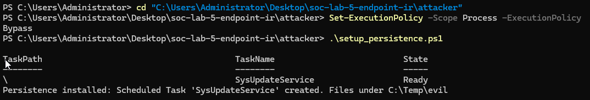

---

### 2️⃣ Verify Scheduled Task  
Querying Windows Task Scheduler confirmed the malicious task’s presence and startup trigger.  
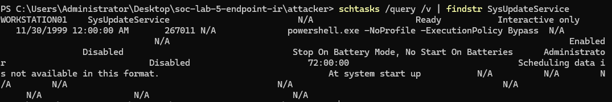

---

### 3️⃣ Enumerate Running Processes  
A full verbose tasklist was captured to identify potential malicious activity.  
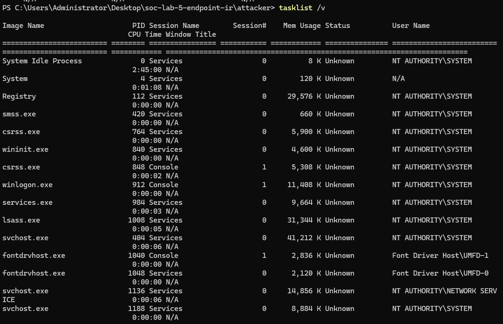

---

### 4️⃣ Network Connections  
`netstat -ano` revealed multiple established external connections from the host.  
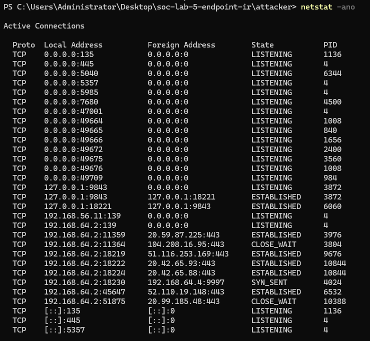

---

### 5️⃣ Services Status  
All Windows services were enumerated to confirm standard configurations and rule out rogue services.  
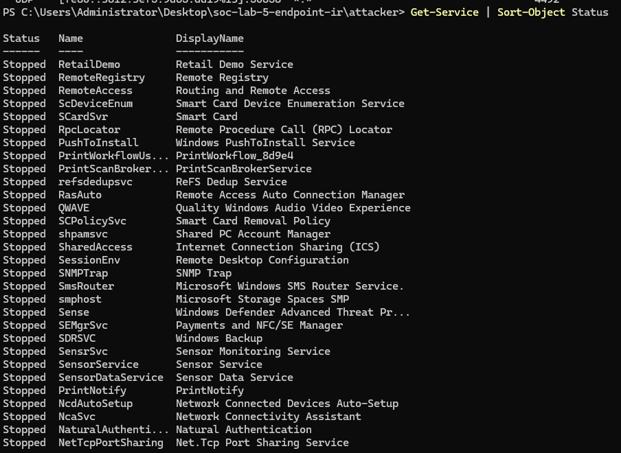

---

### 6️⃣ Registry – System Run Key (HKLM)  
Checked global startup entries. Only legitimate `SecurityHealthSystray.exe` was found.  
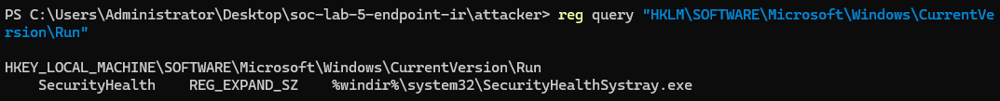

---

### 7️⃣ Registry – User Run Key (HKCU)  
Confirmed standard user startup items (OneDrive, Edge).  
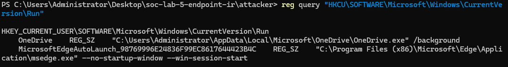

---

### 8️⃣ Hash Suspicious Binary  
The malicious binary’s SHA-256 hash was generated for reference:  
8E1A3617EC1599E798FE8F3995B104D9D6D2E4B57099E44...

yaml
Copy code
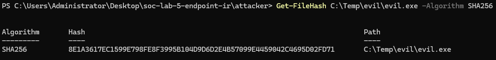

---

### 9️⃣ Prefetch Check  
No prefetch entry was found for `evil.exe`, suggesting it has not executed or Prefetch is disabled.  
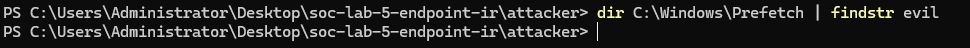

---

### 🔟 Security Event Logs  
Recent Windows Security log entries (IDs 4624/4625/4800/4801) showed normal logon activity.  

---

### 1️⃣1️⃣ Artifact Collection  
Collected process, network, service, and registry data to a forensic folder for analysis.  
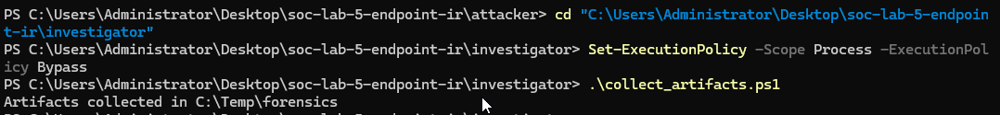

---

### 1️⃣2️⃣ Artifact Import Verification  
Verified that all evidence files were successfully gathered under `C:\Temp\forensics`.  
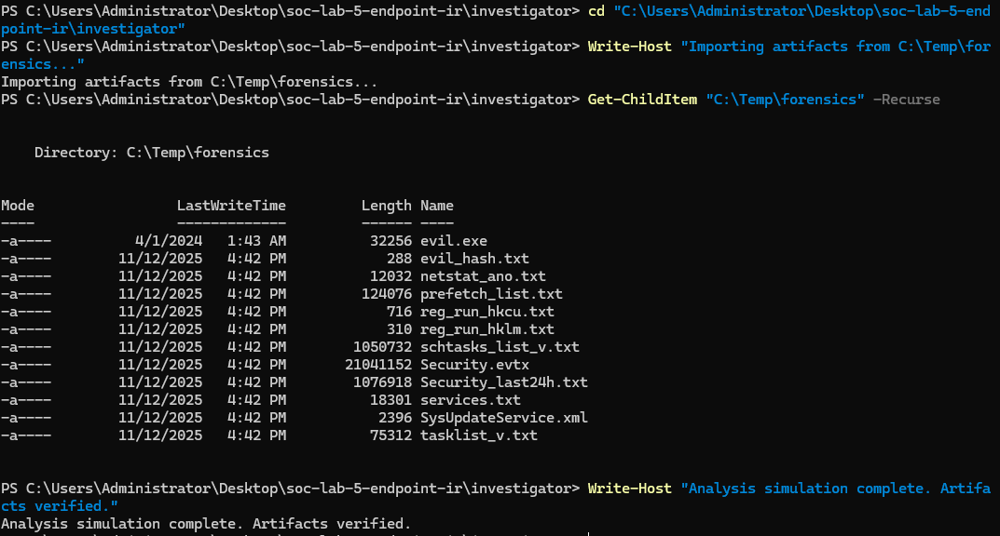

---

## 🧩 Findings Summary
| Category | Observation |
|-----------|--------------|
| **Persistence** | Malicious scheduled task `SysUpdateService` created to maintain access |
| **File Hash** | SHA-256 = `8E1A3617EC1599E798FE8F3995B104D9D6D2E4B57099E44…` |
| **Registry** | No unauthorized startup keys detected |
| **Network** | Outbound TCP connections to multiple external IP addresses |
| **Prefetch** | No execution trace of evil.exe found |
| **Security Logs** | Normal logon/logout activity |

---

## 📦 Artifact Location
C:\Temp\forensics

yaml
---

## 🧮 Timeline Reference
Timeline entries are stored in  
[`docs/timeline_template.csv`](./docs/timeline_template.csv)

---

## ✅ Conclusion
This lab demonstrated a full endpoint incident response workflow **without external logging or SIEM tools**.  
Using only native PowerShell and Windows utilities, the analyst detected persistence, validated system integrity, and performed initial forensic triage—mirroring the capabilities of a first responder operating in a restricted or offline environment.

---

**Created by Chris (M.) | SOC Labs – Endpoint IR Series**